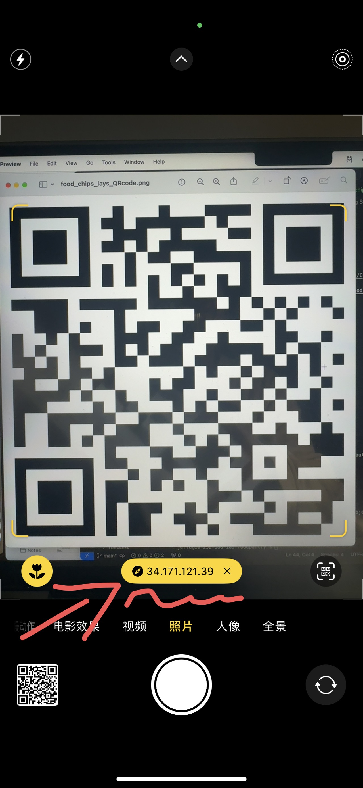
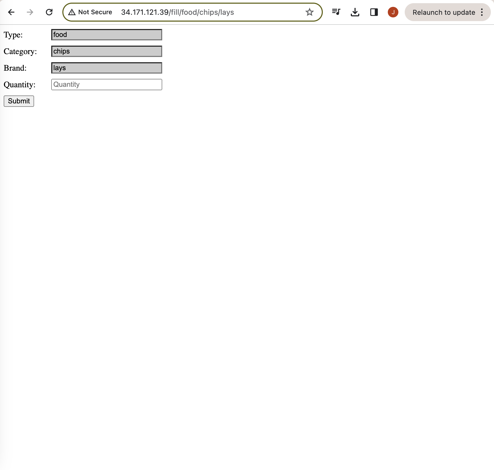

# CPSC-415-02 Food pantry demo
An initial exploration of this project based on our previous discussions.  


Structure:  
1. web.py: Flask Python
2. index.html: html
3. Firebase: database

## Getting Started
These instructions will get you a copy of the project up and running on your local machine for development and testing purposes.  

### Local Installation
If any of those commands doesn't work just switch "python3" to "python."  
1. Install Python   

2. Install pip  
```
python3 -m pip install --upgrade pip
```
3. Install Flask  
```
python3 -m pip install Flask
```
4. Run web.py
```
python3 web.py
```
5. Enter http://localhost:8000/fill/food/chips/lays into your browser to access the form page.  
 What should be there at http://localhost:8000/fill/food/chips/lays:  
   
What should be there at :  
[Firebase Console](https://console.firebase.google.com/project/foodpantry-1a506/database/foodpantry-1a506-default-rtdb/data?hl=zh-cn)  
 
6. If you want to change the content of Type/Category/Brand, just change the URL.  
  
Example:  
To get a form like that:  
Type: A  
Category:B  
Brand: C  
To access the form with info in the example, just change the URL to  http://localhost:8000/fill/A/B/C


### User Operation Process
1. Scan a QR code with your Mobile phone camera:  

2. Click on the URL that appears:  

3. You should see this in your browser:  

4. Enter any number in and then check it out on [Firebase Console](https://console.firebase.google.com/project/foodpantry-1a506/database/foodpantry-1a506-default-rtdb/data?hl=zh-cn)  
- Note: You need to log in with a Google account.  
- Note: You need to be added as a Member to access the Firebase Console.  

### Prerequisites
1. Python  
2. A Google account to log in firebase

## Changelog
