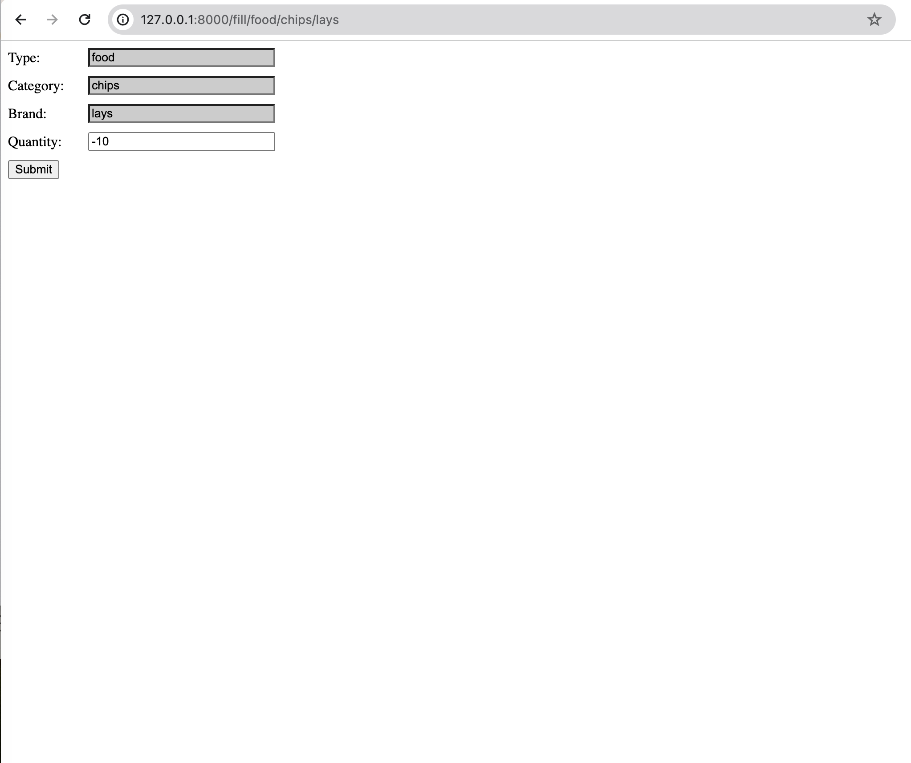
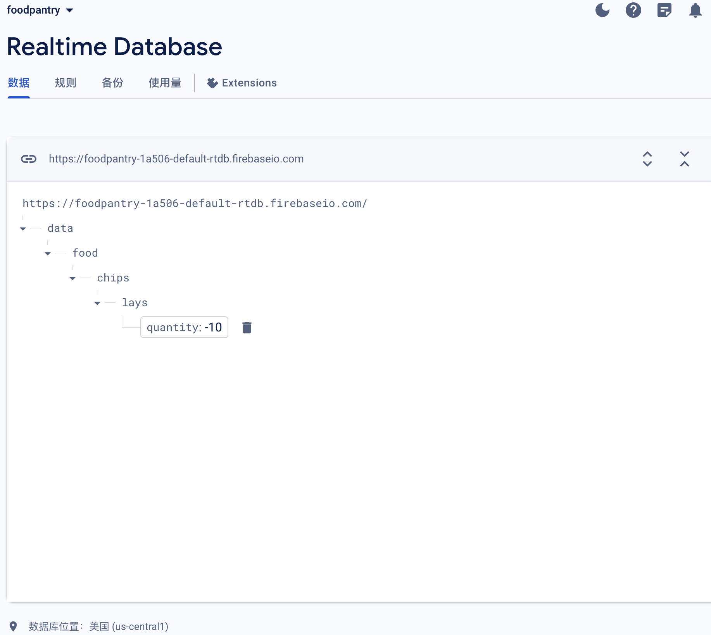

# CPSC-415-02 Food pantry demo
An initial exploration of this project based on our previous discussions.  


Structure:  
1. UI: html  
2. Database: Firebase  

## Getting Started
These instructions will get you a copy of the project up and running on your local machine for development and testing purposes.  
If any of those commonds doesn't work just switch "python3" to "python."  

1. Install python   

2. Install pip  
```
python3 -m pip install --upgrade pip
```
3. Install Flask  
```
python3 -m pip install Flask
```
4. Run web.py
```
python3 web.py
```
5. Enter http://localhost:8000/fill/food/chips/lays into your browser to access the form page.  
6. If you want to change the content of Type/Category/Brand, just change the URL.  
Example:
To get a form like that:
Type: A
Category:B
Brand: C
Just change the URL to  http://localhost:8000/fill/A/B/C

## What should be there:
1. 
2. 

### Prerequisites
1. Python  
2. A firebase account

## Changelog
